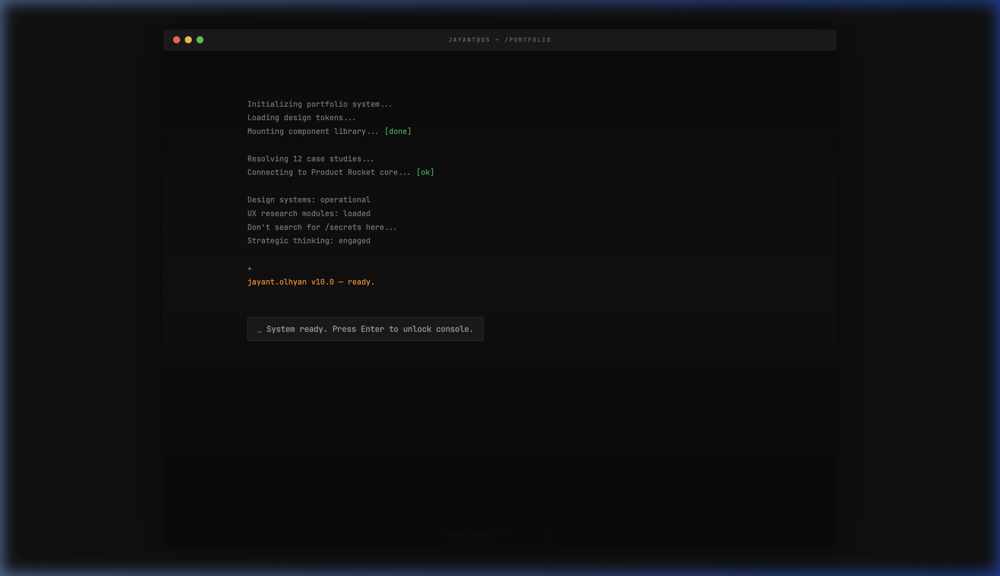
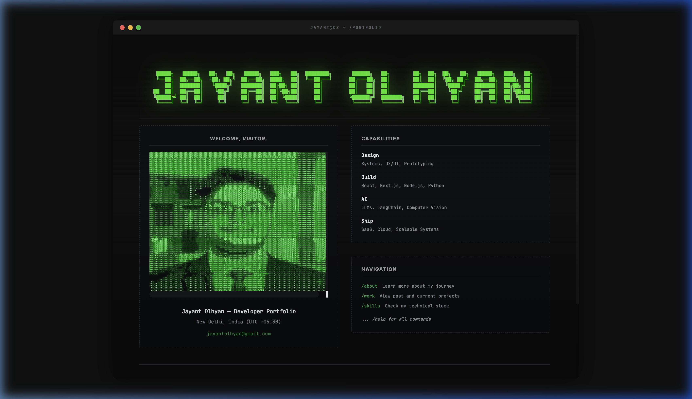
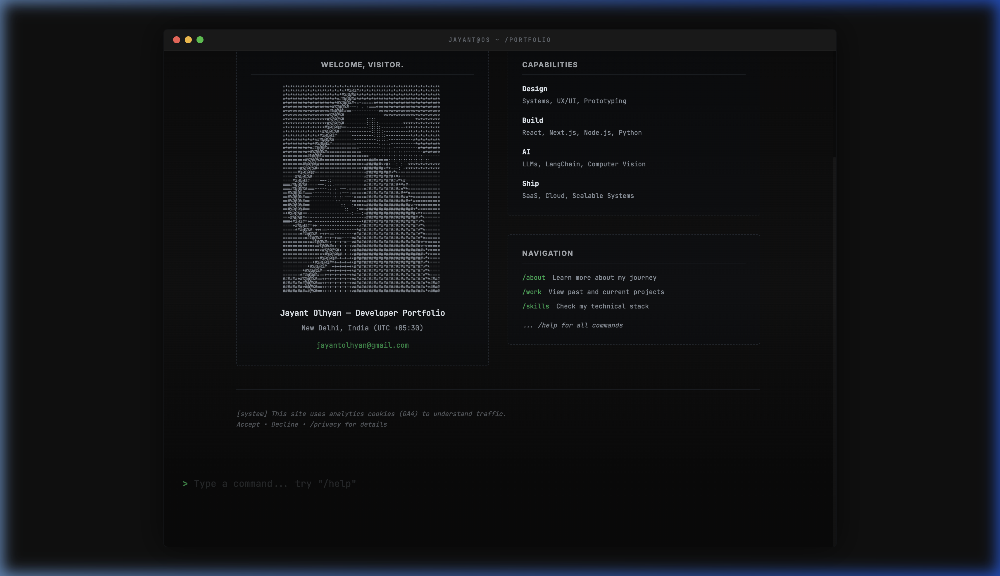

# 🖥️ The Kernel Portfolio: A Terminal OS Experience

[](https://reactjs.org/)
[](https://vitejs.dev/)
[](https://tailwindcss.com/)
[](https://www.framer.com/motion/)

> [!NOTE]
> Welcome to a high-fidelity, developer-first terminal emulation portfolio. This isn't just a website; it's a lightweight mock-operating system designed to showcase technical mastery through a nostalgic yet cutting-edge Command Line Interface (CLI).

---

## 🌌 Project Overview

Inspired by the precision and aesthetic of professional terminal interfaces (like [Vlad Burca's work](https://vladburca.com/)), this portfolio utilizes a React-driven engine to simulate a real-time boot sequence, filesystem navigation, and dynamic theme switching.

```text
 █████╗   █████╗   ██╗   ██╗   █████╗   ███╗   ██╗  ████████╗       ██████╗   ██╗        ██╗  ██╗  ██╗   ██╗   █████╗   ███╗   ██╗ 
 ╚══██╗  ██╔══██╗  ╚██╗ ██╔╝  ██╔══██╗  ████╗  ██║  ╚══██╔══╝      ██╔═══██╗  ██║        ██║  ██║  ╚██╗ ██╔╝  ██╔══██╗  ████╗  ██║ 
    ██║  ███████║   ╚████╔╝   ███████║  ██╔██╗ ██║     ██║         ██║   ██║  ██║        ███████║   ╚████╔╝   ███████║  ██╔██╗ ██║ 
██  ██║  ██╔══██║    ╚██╔╝    ██╔══██║  ██║╚██╗██║     ██║         ██║   ██║  ██║        ██╔══██║    ╚██╔╝    ██╔══██║  ██║╚██╗██║ 
╚█████╔╝ ██║  ██║     ██║     ██║  ██║  ██║ ╚████║     ██║         ╚██████╔╝  ███████╗   ██║  ██║     ██║     ██║  ██║  ██║ ╚████║ 
 ╚════╝  ╚═╝  ╚═╝     ╚═╝     ╚═╝  ╚═╝  ╚═╝  ╚═══╝     ╚═╝          ╚═════╝   ╚══════╝   ╚═╝  ╚═╝     ╚═╝     ╚═╝  ╚═╝  ╚═╝  ╚═══╝ 
```

---

## 🚀 Core Features

- **⚡ Instant Boot Sequence**: A simulated BIOS boot process that initializes system modules and metadata.
- **📟 Interactive CLI**: A fully functional command prompt supporting directory navigation, system checks, and interactive portal switches.
- **🎨 Dynamic Themes**: Toggle between `Glassmorphism`, `Retro Terminal (Matrix)`, and `Midnight Dark` modes.
- **🖼️ ASCII Portrait Engine**: A custom-rendered developer portrait built using technical symbols and high-contrast glow effects.
- **📱 Responsive Shell**: A mobile-optimized layout that preserves the terminal aesthetic on all screen sizes.

---

## 🛠️ Tech Stack

- **Framework**: React 18 (Vite)
- **Styling**: Tailwind CSS v4.0 (for utility-first typography and custom scanline effects)
- **Animation**: Framer Motion (orchestrating boot sequence and content transitions)
- **Icons**: Lucide React
- **Data Source**: Modular JS configuration for easy content updates.

---

## 📸 Interface Showcase

| Boot Sequence | Primary Dashboard | Symbolist Portrait |
| :---: | :---: | :---: |
|  |  |  |

---

## ⚙️ Project Structure

```text
/src
  /components
    /sections     # Discrete OS modules (About, Projects, Skills)
    /ui           # Atomic terminal components (Shell, Prompt, TypeWriter)
  /data           # Single source of truth (Portfolio metadata & ASCII)
  /hooks          # Custom OS logic (Terminal logic, Typing simulation)
  /layouts        # The Main Shell container
```

---

## 🛠️ Local Development

To clone and run this terminal locally:

1. **Clone the repository**:
   ```bash
   git clone https://github.com/JayantOlhyan/Jayant-Olyan-Portfolio-2-.git
   ```

2. **Install dependencies**:
   ```bash
   npm install
   ```

3. **Launch the environment**:
   ```bash
   npm run dev
   ```

---

## 🤝 Connect

> [!TIP]
> Interested in collaboration or a project breakdown? Reach out via the terminal's `/contact` command or connect directly.

- **GitHub**: [@JayantOlhyan](https://github.com/JayantOlhyan)
- **Portfolio**: [jayant-s-portfolio.netlify.app](https://jayant-s-portfolio.netlify.app/)

---

<p align="center">
  <b>Built with ❤️ by Jayant Olhyan</b><br>
  <i>Empowering technical narratives through interface excellence.</i>
</p>
