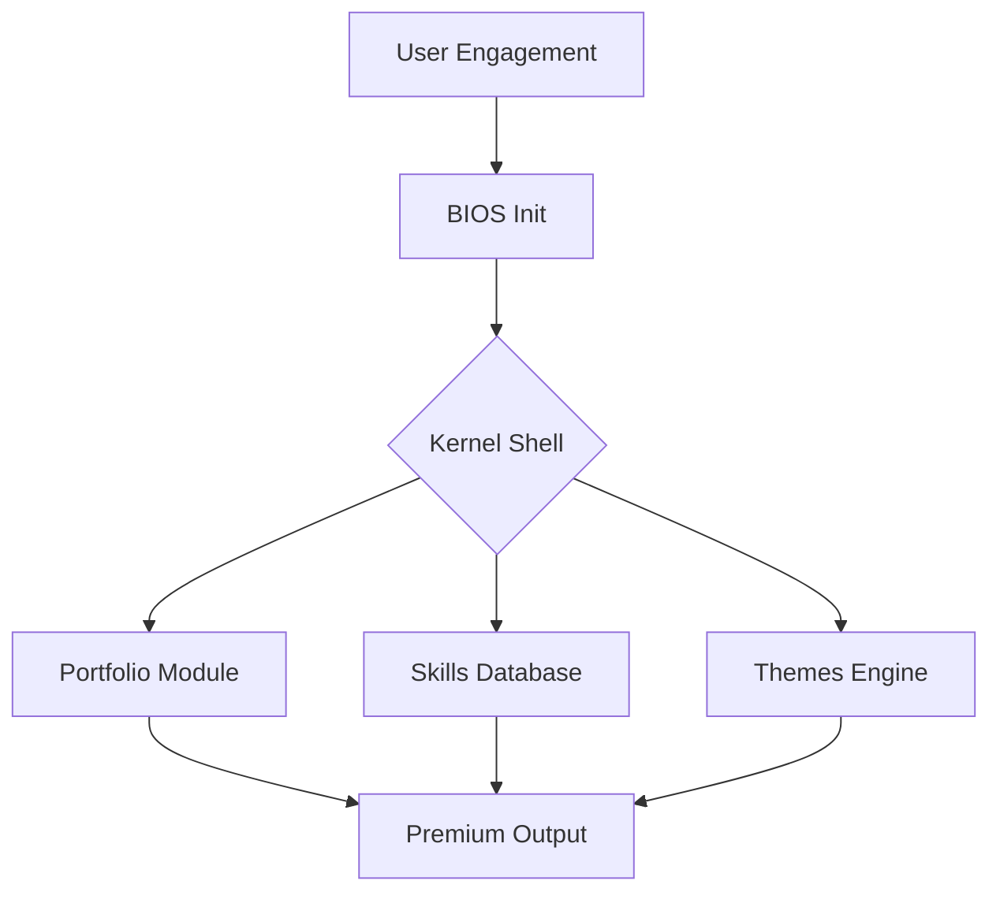

# 🏛️ The Kernel Portfolio: Jayant Olhyan's Developer OS

[](https://reactjs.org/)
[](https://vitejs.dev/)
[](https://jayant-olhyan-portfolio-2.netlify.app/)
[](https://tailwindcss.com/)

<p align="center">
  
</p>

> [!IMPORTANT]
> **ACCESS KERNEL**: [jayant-olhyan-portfolio-2.netlify.app](https://jayant-olhyan-portfolio-2.netlify.app/)

---

## 🌌 The Mission

Inspired by high-fidelity design systems and professional terminal emulation (such as **Vlad Burca's** work), this portfolio uses a React-driven engine to simulate a full BIOS-to-Shell environment. It bridges technical mastery with a nostalgic yet cutting-edge UI.

---

## 🏗️ Interactive OS Components

Every module in this portfolio is an interactive terminal program. Below is a visual guide to the system architecture and shell modules.



---

## 📟 Project Gallery

Explore the diverse systems of the Kernel Portfolio in their official "Neo-Brutal" Matrix theme.

<table>
  <tr>
    <td align="center"><b>Identity Archive</b><br/></td>
    <td align="center"><b>Technical Skill-Matrix</b><br/></td>
  </tr>
  <tr>
    <td align="center"><b>Deployment Log</b><br/></td>
    <td align="center"><b>Connection Protocol</b><br/></td>
  </tr>
</table>

---

## 🚀 Technical Highlights

- **⚡ Instant Boot Sequence**: Leverages `Framer Motion` for high-fidelity state transitions.
- **📟 Interactive CLI**: Custom Terminal logic with directory navigation and real-time execution.
- **🎨 Dynamic Theme Engine**: Seamlessly switch between `Matrix`, `Glass`, and `Retro` themes.
- **🖼️ Official "JO" Monogram**: Minimalist isometric wireframe branding that defines the project's visual DNA.

---

## 🛠️ Local Development

1. **Clone the Archives**:
   ```bash
   git clone https://github.com/JayantOlhyan/Jayant-Olyan-Portfolio-2-.git
   ```

2. **Initialize Engine**:
   ```bash
   npm install && npm run dev
   ```

---

## 🤝 Let's Collaborate

- **GitHub**: [@JayantOlhyan](https://github.com/JayantOlhyan)
- **LinkedIn**: [Jayant Olhyan](https://www.linkedin.com/in/jayantolhyan/)
- **Live Port**: [jayant-olhyan-portfolio-2.netlify.app](https://jayant-olhyan-portfolio-2.netlify.app/)

---

<p align="center">
  <b>Designed for performance. Engineered for excellence.</b><br>
  <i>© 2026 Jayant Olhyan. All system protocols active.</i>
</p>
