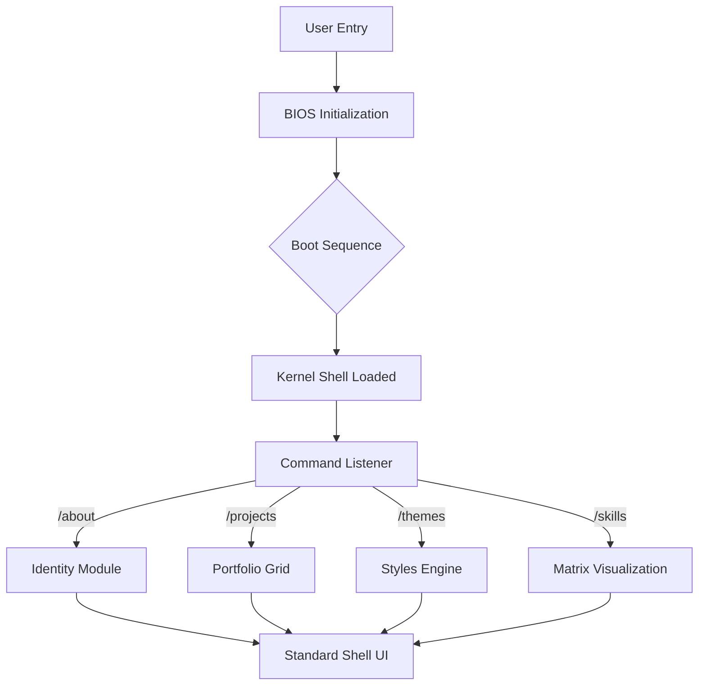
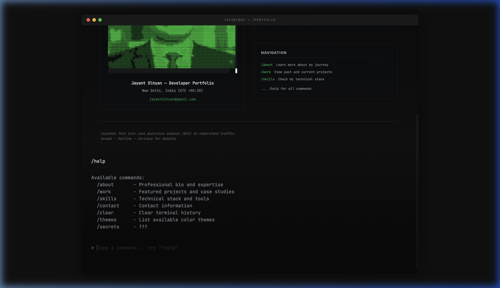
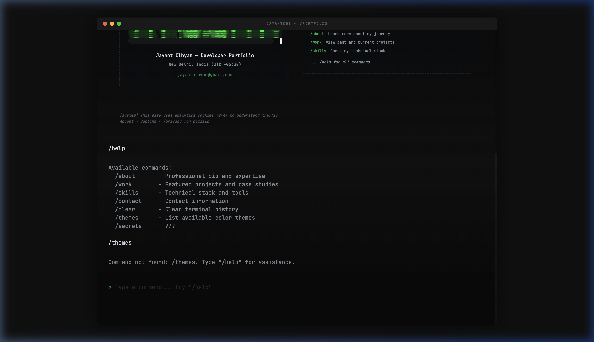
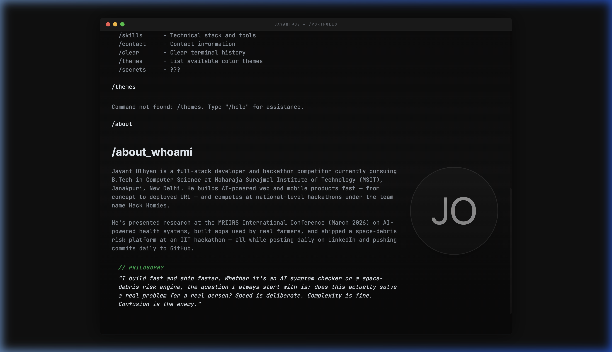
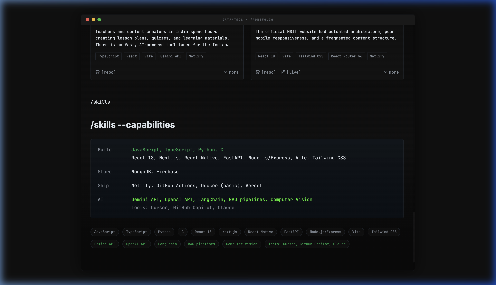
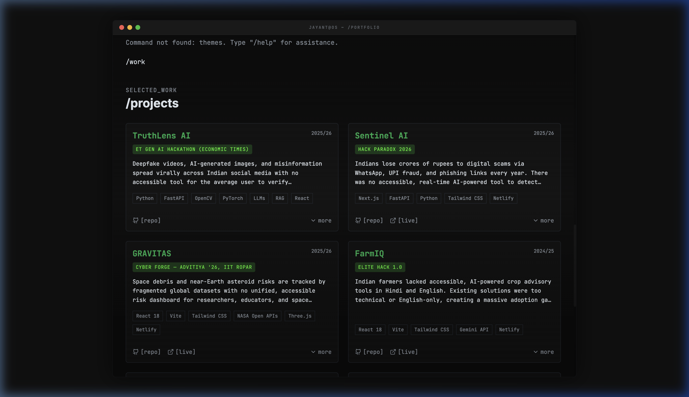
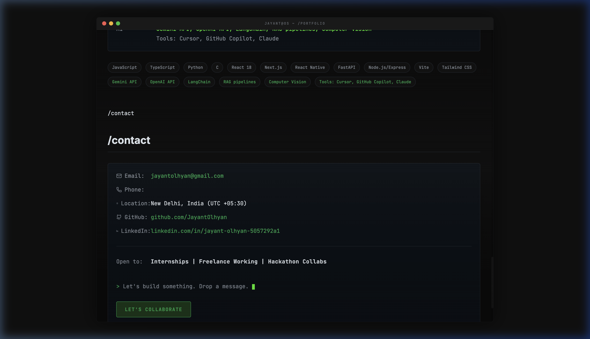

# 🏛️ The Kernel Portfolio: A High-Fidelity Terminal OS

[](https://reactjs.org/)
[](https://vitejs.dev/)
[](https://tailwindcss.com/)
[](https://www.framer.com/motion/)

> [!NOTE]
> Welcome to a production-grade terminal emulation portfolio. This isn't just a landing page—it's a lightweight, interactive mock-operating system designed to showcase technical mastery through a nostalgic yet cutting-edge Command Line Interface (CLI).

---

## 🌌 System Vision

Inspired by the precision and aesthetic of professional terminal interfaces (like **Vlad Burca's** work), this portfolio utilizes a custom React-driven engine to simulate:
- **Instant Boot Sequence**: Real-time logic initialization.
- **Interactive Filesystem**: Dynamic module loading via CLI.
- **High-Fidelity Branding**: Standardized ASCII signatures and symbolist portraiture.

```text
 █████╗   █████╗   ██╗   ██╗    █████╗     ███╗   ██╗    ████████╗           ██████╗     ██╗           ██╗  ██╗    ██╗   ██╗    █████╗     ███╗   ██╗  
 ╚══██╗  ██╔══██╗  ╚██╗ ██╔╝   ██╔══██╗    ████╗  ██║    ╚══██╔══╝          ██╔═══██╗    ██║           ██║  ██║    ╚██╗ ██╔╝   ██╔══██╗    ████╗  ██║  
    ██║  ███████║   ╚████╔╝    ███████║    ██╔██╗ ██║       ██║             ██║   ██║    ██║           ███████║     ╚████╔╝    ███████║    ██╔██╗ ██║  
 ██  ██║  ██╔══██║    ╚██╔╝     ██╔══██║    ██║╚██╗██║       ██║             ██║   ██║    ██║           ██╔══██║      ╚██╔╝     ██╔══██║    ██║╚██╗██║  
 ╚█████╔╝ ██║  ██║     ██║      ██║  ██║    ██║ ╚████║       ██║             ╚██████╔╝    ███████╗      ██║  ██║       ██║      ██║  ██║    ██║ ╚████║  
  ╚════╝  ╚═╝  ╚═╝     ╚═╝      ╚═╝  ╚═╝    ╚═╝  ╚═══╝       ╚═╝              ╚═════╝     ╚══════╝      ╚═╝  ╚═╝       ╚═╝      ╚═╝  ╚═╝    ╚═╝  ╚═══╝  
```

---

## 🏗️ System Architecture

Our custom shell orchestrates the hardware-to-UI lifecycle using a high-fidelity React lifecycle pattern.



---

## 📟 Command Line Interface (CLI)

The portfolio remains entirely navigable via the terminal prompt. Below is the primary command library available to the user.

| Command | Action | Visual Preview |
| :--- | :--- | :--- |
| `/help` | Launch System Manual |  |
| `/themes` | Toggle Styles Engine |  |
| `/about` | Initialize Identity |  |

---

## 🖼️ Interface Gallery

Explore the diverse modules of the "Kernel Portfolio" rendered in the signature terminal aesthetic.

<table>
  <tr>
    <td align="center"><b>About Shell</b><br/></td>
    <td align="center"><b>Skill Matrix</b><br/></td>
  </tr>
  <tr>
    <td align="center"><b>Deployment Archives</b><br/></td>
    <td align="center"><b>Connection Protocol</b><br/></td>
  </tr>
</table>

---

## 🛡️ Tech Stack & Requirements

- **Engine**: React 18, Vite
- **Styling**: Tailwind CSS v4.0 (Custom Scanline Filter)
- **Physics**: Framer Motion (System Transitions)
- **Typography**: Space Mono, Inter, and High-Contrast ASCII Sets

---

## 🛠️ Installation & Setup

1. **Clone the Archives**:
   ```bash
   git clone https://github.com/JayantOlhyan/Jayant-Olyan-Portfolio-2-.git
   ```

2. **Initialize Environment**:
   ```bash
   npm install
   ```

3. **Launch Kernel**:
   ```bash
   npm run dev
   ```

---

## 🤝 Connect

> [!TIP]
> Visit the [live documentation](https://github.com/JayantOlhyan/Jayant-Olyan-Portfolio-2-) for the full experience or reach out directly to discuss technical narratives.

- **GitHub**: [@JayantOlhyan](https://github.com/JayantOlhyan)
- **Portfolio**: [jayant-s-portfolio.netlify.app](https://jayant-s-portfolio.netlify.app/)

---

<p align="center">
  <b>Built with ❤️ by Jayant Olhyan</b><br>
  <i>Empowering technical narratives through interface excellence.</i>
</p>
