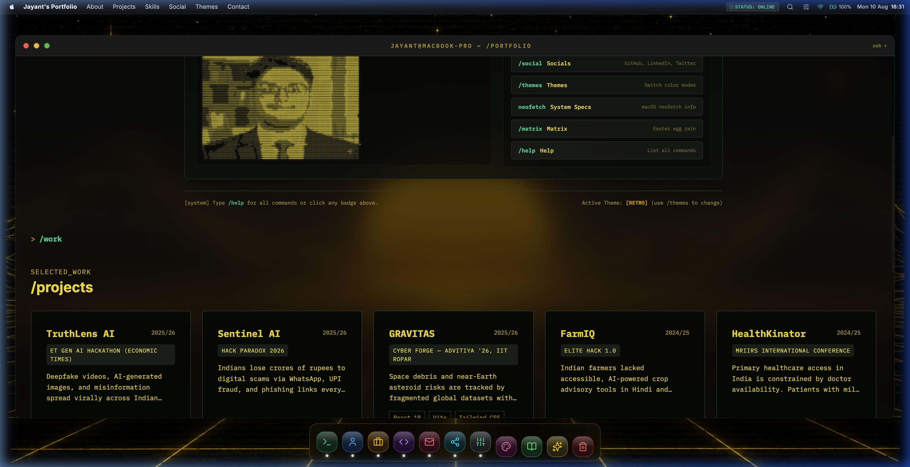
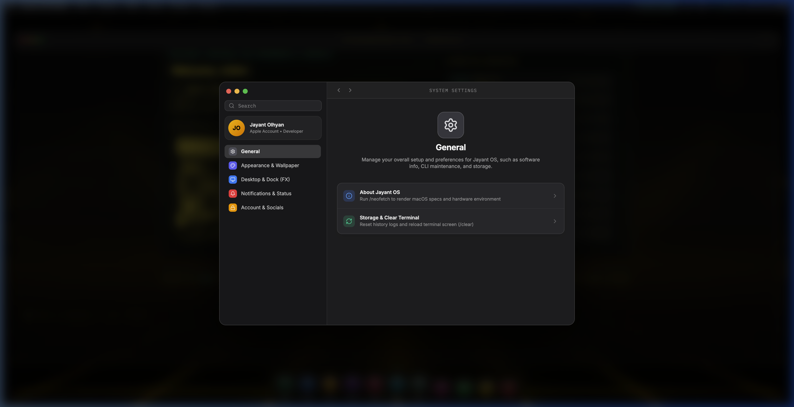
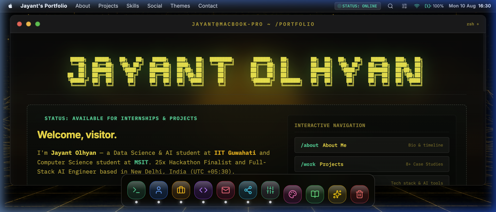

<div align="center">


# 🖥️ Jayant Olhyan | Portfolio OS v10.0

### *A Web-Based macOS Sequoia Desktop & Zsh Terminal Operating System*

[](https://jayant-olhyan-portfolio-2.netlify.app/)
[](LICENSE)
[](https://reactjs.org/)
[](https://vitejs.dev/)
[](https://tailwindcss.com/)

<br/>

<a href="https://jayant-olhyan-portfolio-2.netlify.app/">
  
</a>

<p align="center">
  <b>Data Science & AI @ IIT Guwahati</b> • <b>B.Tech CSE @ MSIT</b> • <b>25x Hackathon Finalist</b>
</p>

[🌐 Visit Live Website](https://jayant-olhyan-portfolio-2.netlify.app/) • [📸 Screenshots & Previews](#-visual-tour--feature-showcase) • [🛠️ How It Works](#-how-it-works-under-the-hood) • [📘 Developer Blueprint](#-build-your-own-macos-portfolio-os-step-by-step) • [🚀 Deploy Guide](#-deployment--seo-setup)

</div>

---

## 🌟 Executive Overview

**Portfolio OS** is a modern, interactive web application engineered to showcase technical projects, hackathon achievements, and software engineering capabilities. Rather than a standard scrolling webpage, Portfolio OS presents a **macOS Sequoia desktop operating system** complete with an Apple top menu bar, interactive Control Center, 120 FPS spring-physics dock, system settings control panel, and a **zsh terminal CLI engine**.

---

## 📸 Visual Tour & Feature Showcase

<details open>
<summary><b>📺 Expand / Collapse Interactive Screenshots & System Modules</b></summary>

<br/>

### 1. Main Terminal OS Dashboard (`/`)
Featuring a live system status ping, glowing developer ASCII portrait, interactive command prompt, and squircle glass dock.


### 2. Selected Projects & Hackathon Showcase (`/work`)
Renders interactive project cards for deepfake detectors, orbital space debris monitors, and AI crop advisory tools with live demo and source code links.


### 3. macOS Sequoia System Settings (`/settings`)
Interactive system preference window allowing visitors to change wallpapers, adjust animation effects, toggle matrix rain, and view hardware specs.


### 4. Twitter / Social Media Card (`twitter-card.png`)
High-resolution 1200x600 preview banner optimized for social media links on Twitter/X, LinkedIn, Discord, and WhatsApp.


</details>

---

## ⚙️ Technologies Used

| Technology Layer | Tool / Library | Version | Purpose |
| :--- | :--- | :--- | :--- |
| **Core Framework** | `React` | `v18.3.x` | Component-based UI rendering and virtual DOM state management |
| **Build Engine** | `Vite` | `v8.0.x` | Lightning-fast development server with instant Hot Module Replacement (HMR) |
| **Styling & Design** | `Tailwind CSS` | `v4.0.x` | Utility-first CSS styling, Glassmorphism backdrops, and responsive layouts |
| **Motion & Physics** | `Framer Motion` | `v11.x` | Production-ready spring physics (`useSpring`, `useTransform`), smooth modal transitions |
| **Icons & Media** | `Lucide React` | `v0.4x` | Modern macOS UI icon set |
| **Routing & SEO** | `React Router v6` | `v6.x` | SPA client-side routing & deep linking |
| **Hosting & Edge** | `Netlify Edge` | Global CDN | Ultra-fast global static deployment with automatic HTTPS |

---

## 🛠️ How It Works (Under the Hood)

### 1. The Terminal State Machine (`useTerminal.js`)
The core terminal operates as an interactive command processor state machine.
```
  [User Keyboard Input] ──> [Command Parser] ──> [Command Registry]
                                                       │
         ┌─────────────────────────────────────────────┴─────────────────────────────┐
         ▼                                             ▼                             ▼
  /about, /work, /skills                       /themes, /matrix                     neofetch, /clear
  (Appends output buffer)                      (Triggers UI state)               (Executes system utility)
```
- **Parsing**: Intercepts slash commands (`/about`, `/work`, `/themes`) and standard commands (`neofetch`, `help`, `clear`).
- **Autocomplete Engine**: Monitors input string on input change (`/`) and filters available system protocols in real time, permitting `Tab` or `Enter` completion and `ArrowUp`/`ArrowDown` navigation.
- **Command History**: Stores executed commands in a circular array, retrievable via `ArrowUp` and `ArrowDown` keys.

### 2. macOS Dock 120 FPS Spring Magnification Physics
The dock items dynamically enlarge based on proximity to the cursor position without triggering DOM layout reflows:
```javascript
// Calculate cursor distance relative to icon center
const distance = useTransform(mouseX, (val) => {
  if (!ref.current) return 1000;
  const bounds = ref.current.getBoundingClientRect();
  return val - bounds.x - bounds.width / 2;
});

// Map distance [-140px, 0px, +140px] to icon width [44px, 72px, 44px]
const widthSync = useTransform(distance, [-140, 0, 140], [44, 72, 44]);

// Apply high-stiffness, ultra-low-mass spring physics for instant 120fps magnification
const width = useSpring(widthSync, { mass: 0.05, stiffness: 400, damping: 25 });
```

### 3. Dynamic Theme & Wallpaper Engine
Wallpapers and theme tokens are bound to root CSS variables and background image layers:
- **`main`**: Cyber Mountains (Electric green & blue horizon)
- **`retro`**: 1983 Retro CRT Grid (Yellow perspective grid & matrix code rain)
- **`dark`**: Cyberpunk Metallic Shards (3D metallic glass & cyan traces)
- **`space`**: Cosmic Galaxy Nebula (Deep space & constellation nodes)
- **`glass`**: Glassmorphism Spheres (Translucent violet frosted panels)

---

## 📘 Build Your Own macOS Portfolio OS (Step-by-Step)

Want to build or customize a similar Portfolio OS for your own developer profile? Follow this complete step-by-step guide!

### Step 1: Clone & Setup Local Environment
```bash
# 1. Clone the repository
git clone https://github.com/JayantOlhyan/Jayant-Olyan-Portfolio-2-.git

# 2. Enter project directory
cd "Jayant-Olyan-Portfolio-2-"

# 3. Install dependencies
npm install

# 4. Start local development server
npm run dev
```

### Step 2: Customize Your Developer Data (`src/data/portfolioData.js`)
All content on the site is modularly driven by `src/data/portfolioData.js`. Simply open this file and update the exported objects:

```javascript
// 1. Update Personal Metadata
export const siteMetadata = {
  title: 'Your Name | Developer Portfolio',
  name: 'Your Name',
  headline: 'Computer Science Student & Full Stack Engineer',
  subHeadline: 'Building AI & Web Applications',
  location: 'Your City, Country',
  email: 'your.email@example.com',
  github: 'https://github.com/yourusername',
  linkedin: 'https://linkedin.com/in/yourusername',
  openTo: ['Full-time Jobs', 'Internships', 'Open Source']
};

// 2. Add Your Projects
export const projects = [
  {
    id: "my-first-app",
    title: "Awesome AI App",
    year: "2026",
    problem: "Brief description of the problem solved.",
    solution: "How your application solves it using AI/Web tech.",
    stack: ["React", "FastAPI", "Python", "Tailwind CSS"],
    impact: "Key metric or hackathon achievement.",
    github: "https://github.com/yourusername/app",
    live: "https://myapp.netlify.app",
    featured: true
  }
];
```

### Step 3: Customize Favicons & Logos
Replace the image files in the `public/` directory with your own branding icons:
- `public/apple-touch-icon.png` (180x180 px)
- `public/favicon-32x32.png` (32x32 px)
- `public/favicon-16x16.png` (16x16 px)
- `public/favicon.png` (512x512 px)
- `public/logo.png` (512x512 px)

---

## ⚡ Interactive Terminal Commands Reference

| Command | Shortcut / Action | Description |
| :--- | :--- | :--- |
| **`/about`** | Click **About** | Bio, academic background, and technical journey. |
| **`/work`** | Click **Projects** | View case studies & hackathon project cards (*TruthLens AI*, *Sentinel AI*, *GRAVITAS*, *FarmIQ*). |
| **`/skills`** | Click **Skills** | Technical skill matrix (Build, Store, Ship, AI/ML tools). |
| **`/contact`** | Click **Contact** | Direct contact channels & email form. |
| **`/social`** | Click **Socials** | Quick links to GitHub, LinkedIn, Twitter, Devpost. |
| **`/themes`** | Click **Themes** | Open visual wallpaper and theme switcher modal. |
| **`neofetch`** | System Specs | Print macOS system information and hardware specs. |
| **`/matrix`** | Easter Egg | Activate full-screen green Matrix code rain overlay. |
| **`/clear`** | Clear Screen | Reset terminal logs and wipe screen buffer. |
| **`/help`** | Command List | List all active system commands. |

---

## 🚀 Deployment & SEO Setup

### Deploying to Netlify (Recommended)
1. Push your repository to GitHub.
2. Log into [Netlify](https://www.netlify.com/) and click **Add New Site** > **Import an existing project**.
3. Select your GitHub repository.
4. Set Build Settings:
   - **Build Command**: `npm run build`
   - **Publish Directory**: `dist`
5. Click **Deploy Site**.

### SEO & Social Preview Configuration (`index.html`)
The portfolio includes complete OpenGraph and Twitter card meta tags for crisp sharing previews:

```html
<!-- Open Graph / Facebook / LinkedIn / Discord -->
<meta property="og:type" content="website">
<meta property="og:url" content="https://jayant-olhyan-portfolio-2.netlify.app/">
<meta property="og:title" content="Jayant Olhyan | Data Science & AI | Portfolio">
<meta property="og:description" content="Explore the macOS-themed portfolio of Jayant Olhyan.">
<meta property="og:image" content="https://jayant-olhyan-portfolio-2.netlify.app/og-image.png">

<!-- Twitter / X -->
<meta property="twitter:card" content="summary_large_image">
<meta property="twitter:image" content="https://jayant-olhyan-portfolio-2.netlify.app/twitter-card.png">
```

---

## 👤 About the Developer

<p align="left">
  <b>Jayant Olhyan</b><br/>
  🎓 <b>Data Science & AI</b> — Indian Institute of Technology (IIT) Guwahati<br/>
  🎓 <b>B.Tech Computer Science</b> — Maharaja Surajmal Institute of Technology (MSIT)<br/>
  🏆 <b>25x Hackathon Finalist & Winner</b><br/>
  📍 New Delhi, India (UTC +05:30)
</p>

- **Live Portfolio**: [jayant-olhyan-portfolio-2.netlify.app](https://jayant-olhyan-portfolio-2.netlify.app/)
- **GitHub**: [@JayantOlhyan](https://github.com/JayantOlhyan)
- **LinkedIn**: [linkedin.com/in/jayant-olhyan](https://www.linkedin.com/in/jayant-olhyan/)
- **Email**: [jayantolhyan@gmail.com](mailto:jayantolhyan@gmail.com)

---

<div align="center">
  <sub>Built with ❤️ by Jayant Olhyan. Designed for performance, engineered for excellence.</sub>
</div>
