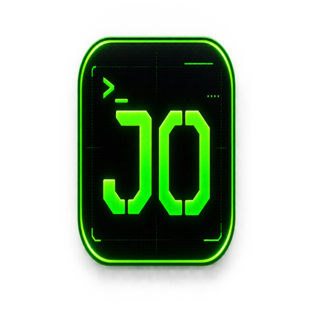
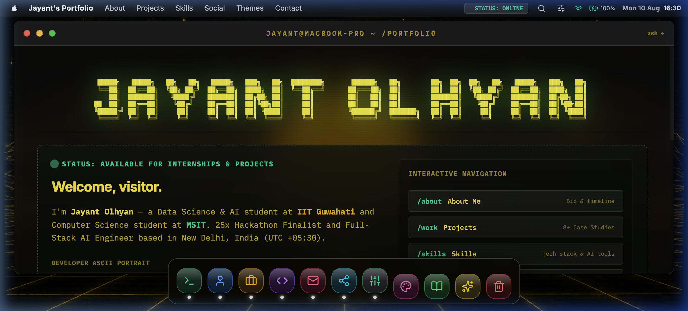

<div align="center">



# 🖥️ Jayant Olhyan | macOS Portfolio OS v10.0

### *Interactive Web-Based macOS Sequoia Desktop & Zsh Terminal Operating System*

[](https://jayant-olhyan-portfolio-2.netlify.app/)
[](https://react.dev/)
[](https://vitejs.dev/)
[](https://tailwindcss.com/)
[](https://www.framer.com/motion/)
[](https://web.dev/progressive-web-apps/)
[](LICENSE)

<br/>

<a href="https://jayant-olhyan-portfolio-2.netlify.app/">
  
</a>

<p align="center">
  <b>🎓 Data Science & AI @ IIT Guwahati</b> • <b>🎓 B.Tech CSE @ MSIT (GGSIPU)</b> • <b>🏆 25x Hackathon Finalist & Winner</b>
</p>

[🌐 Live Website](https://jayant-olhyan-portfolio-2.netlify.app/) • [✨ Core Features](#-core-features) • [⚡ Command Matrix](#-interactive-terminal-commands) • [🛠️ Tech Stack](#-architecture--tech-stack) • [🚀 Quickstart Guide](#-quickstart--local-setup) • [👤 About Jayant](#-about-the-developer)

</div>

---

## 🌟 Executive Summary

**Portfolio OS** is a bleeding-edge developer portfolio built as an interactive **macOS Sequoia desktop operating system**. Designed for speed, utility, and immersive aesthetics, it replaces traditional static portfolios with:

- 🖥️ **Full macOS Window Management**: Draggable, resizable, minimizable, and maximizable terminal windows with genuine macOS traffic light controls.
- ⚡ **Interactive Zsh CLI Terminal Engine**: Autocomplete suggestions, circular command history (`↑` / `↓`), tab completion, and instant route dispatching.
- 🧲 **120 FPS Spring-Physics Dock**: Proximity magnification physics using Framer Motion (`useSpring`, `useTransform`) without layout reflows.
- 💡 **Dynamic 3D Cursor Spotlight Cards**: Real-time CSS coordinate tracking with radial neon glow overlays.
- 🎨 **Wallpaper & Theme Engine**: Instant switcher between 5 visual modes (*Cyber Mountains*, *1983 Retro CRT*, *Metallic Shards*, *Cosmic Space*, and *Frosted Glass*).
- 🏷️ **Comprehensive Brand SVG Sprite**: 36 crisp vector badges across AI models, cloud databases, frameworks, academia, and socials.
- 📱 **PWA & Offline First**: Service worker (v2) caching with instant offline app-shell fallback.
- 🔍 **SEO & Google Rich Graph**: Complete Schema.org JSON-LD structured data graph for `Person`, `WebSite`, and `ItemList`.

---

## ✨ Core Features

| Feature | Description |
| :--- | :--- |
| **🍎 macOS Sequoia Shell** | Authentic Apple top menu bar with live clock, battery status, Control Center modal, system preferences, and quick links. |
| **💻 Interactive CLI** | Command executor supporting 16+ commands (`/work`, `/skills`, `/hackathons`, `/about`, `/social`, `/contact`, `/neofetch`, etc.). |
| **🖱️ 3D Spotlight Cards** | Mouse-following radial emerald glow (`rgba(0, 255, 65, 0.08)`) with smooth hover micro-animations. |
| **📋 1-Click Clipboard Utilities** | Single-click instant copy with checkmark tooltip notifications for email, phone, and project links. |
| **🏆 25x Hackathon Showcase** | Interactive record of national hackathons, IIT podiums, and peer-reviewed research papers (MRIIRS 2026). |
| **📱 Responsive Fluid Typography** | Dynamic `clamp()` typography and CSS grid matrices scaling seamlessly across 320px mobile to 4K ultra-wide displays. |
| **🎉 Interactive Easter Eggs** | Matrix digital rain canvas (`/matrix`), celebration particle streams (`/confetti`), and system diagnostics (`neofetch`). |

---

## ⚡ Interactive Terminal Commands

Visitors can explore the portfolio by typing commands in the terminal prompt or clicking dock and menu bar items:

| Command | Category | Description |
| :--- | :--- | :--- |
| **`/about`** | Bio & Education | Jayant Olhyan's background, IIT Guwahati & MSIT credentials, and verified status. |
| **`/work`** | Projects | 8+ featured AI and full-stack projects with live demos, tech stack pills, and GitHub source code. |
| **`/skills`** | Tech Stack | 4-quadrant interactive grid (Full-Stack, AI/CV, Databases, DevOps) with authentic brand logos. |
| **`/hackathons`** | Track Record | Chronological table of 25x hackathon wins, organizers, and awards. |
| **`/social`** | Connections | Direct links to LinkedIn, GitHub, X (Twitter), Discord, and phone. |
| **`/contact`** | Direct Hire | Fast-response contact channels with 1-click email and phone copying. |
| **`/ecosystem`** | Partner Network | Academic & organizational badges (IIT Guwahati, MSIT, Economic Times, NASA, ESA, Gemini). |
| **`/articles`** | Technical Writing | Research articles, RAG architectures, and AI deployment guides on LinkedIn. |
| **`/testimonials`** | Endorsements | Peer reviews, teammate recommendations, and mentor feedback. |
| **`/philosophy`** | Engineering | Core design and performance principles (*Ship Utility First, Zero Bloat*). |
| **`/themes`** | Appearance | Switch between 5 high-resolution wallpapers and terminal accent colors. |
| **`neofetch`** | System Specs | macOS system configuration, Apple ASCII art, and hardware telemetry. |
| **`/matrix`** | Easter Egg | Full-screen falling green Matrix digital code stream. |
| **`/confetti`** | Easter Egg | Multi-colored celebration particle physics explosion. |
| **`/clear`** | Buffer | Clear terminal screen and reset history buffer. |
| **`/exit`** | Session | Lock terminal session and display macOS restart overlay. |
| **`/help`** | Documentation | Display all available commands and shortcuts. |

---

## 🛠️ Architecture & Tech Stack

```
jayant-portfolio-2/
├── public/                     # Static assets & PWA files
│   ├── icons.svg               # Vector SVG brand sprite (36 tech & social symbols)
│   ├── jayant_professional_photo.png # High-res profile photograph
│   ├── sw.js                   # Service Worker v2 (App Shell & offline cache)
│   ├── sitemap.xml             # XML sitemap with all section routes
│   └── manifest.webmanifest    # Progressive Web App manifest
├── src/
│   ├── components/
│   │   ├── sections/           # Interactive terminal views
│   │   │   ├── About.jsx       # Bio, education pills & verified avatar
│   │   │   ├── Projects.jsx    # Projects showcase with SVG badges & copy link
│   │   │   ├── Skills.jsx      # 4-quadrant tech & AI model matrix
│   │   │   ├── Hackathons.jsx  # Staggered motion table of 25x wins
│   │   │   ├── Social.jsx      # Social profiles with 1-click copy
│   │   │   ├── Contact.jsx     # Direct email CTA & contact details
│   │   │   ├── Ecosystem.jsx   # Institutional partner network
│   │   │   ├── Articles.jsx    # Technical articles & reading time
│   │   │   ├── Testimonials.jsx# Peer reviews & quote cards
│   │   │   ├── Philosophy.jsx  # Engineering principles
│   │   │   └── WelcomeBox.jsx  # ASCII developer portrait & menu
│   │   ├── ui/                 # Reusable UI primitives
│   │   │   ├── TerminalCard.jsx# 3D mouse coordinate spotlight card
│   │   │   ├── Icon.jsx        # Dynamic SVG sprite icon component
│   │   │   ├── MacMenuBar.jsx  # Apple top menu bar & control center
│   │   │   ├── MacDock.jsx     # 120 FPS spring magnification dock
│   │   │   └── MatrixRain.jsx  # HTML5 Canvas green rain animation
│   ├── data/
│   │   ├── portfolioData.js    # Centralized portfolio data (Projects, Skills, Hackathons)
│   │   └── commands.js         # Autocomplete command registry
│   ├── hooks/
│   │   ├── useTerminal.js      # Terminal state machine & routing
│   │   └── useOnlineStatus.js  # Network connectivity detector
│   └── layouts/
│       └── MainLayout.jsx      # Root desktop layout & wallpaper renderer
├── index.html                  # HTML entry point with Schema.org JSON-LD & preloads
└── vite.config.js              # Vite 8 config with Rolldown vendor chunk splitting
```

---

## 🚀 Quickstart & Local Setup

Clone and run the portfolio locally in under 60 seconds:

### Prerequisites
- Node.js `v18.0.0` or higher
- npm or yarn

```bash
# 1. Clone the repository
git clone https://github.com/JayantOlhyan/Jayant-Olyan-Portfolio-2-.git

# 2. Navigate to project root
cd Jayant-Olyan-Portfolio-2-

# 3. Install dependencies
npm install

# 4. Start local development server (with HMR)
npm run dev
```

Open `http://localhost:5173/` in your browser.

### Production Build & Linting

```bash
# Run ESLint validation
npm run lint

# Build optimized production bundle
npm run build

# Preview production build locally
npm run preview
```

---

## 🌟 Featured Project Highlights

| Project | Stack | Description | Links |
| :--- | :--- | :--- | :--- |
| **TruthLens AI** | `React` `FastAPI` `PyTorch` `RAG` | Multi-modal deepfake detection platform combining frame-level artifact analysis with RAG fact-checking. | [Live Demo](https://truthlensai.netlify.app/) • [Source](https://github.com/JayantOlhyan/TruthLens-AI) |
| **Sentinel AI** | `React 18` `Python` `Gemini API` | Real-time scam and phishing detection engine explaining risks in plain language with LLMs. | [Live Demo](https://sentinel-ai-scanner.netlify.app/) • [Source](https://github.com/JayantOlhyan/sentinel-ai) |
| **GRAVITAS** | `Three.js` `NASA API` `FastAPI` | Interactive 3D orbital space debris and asteroid collision risk visualization platform using NASA & ESA telemetry. | [Live Demo](https://gravitas-space.netlify.app/) • [Source](https://github.com/JayantOlhyan/gravitas-space-debris) |
| **FarmIQ** | `React Native` `FastAPI` `Gemini` | Multimodal crop disease detection and voice-assisted agricultural advisory platform for Indian farmers. | [Live Demo](https://farmiq-app.netlify.app/) • [Source](https://github.com/JayantOlhyan/FarmIQ) |

---

## 👤 About the Developer

<p align="left">
  <b>Jayant Olhyan</b><br/>
  🎓 <b>Data Science & AI Specialization</b> — Indian Institute of Technology (IIT) Guwahati<br/>
  🎓 <b>B.Tech in Computer Science & Engineering</b> — Maharaja Surajmal Institute of Technology (MSIT)<br/>
  🏆 <b>25x Hackathon Finalist & Winner</b> across IITs, National Conferences & Global AI Hackathons<br/>
  📍 New Delhi, India (UTC +05:30)
</p>

- 🌐 **Portfolio Website**: [jayant-olhyan-portfolio-2.netlify.app](https://jayant-olhyan-portfolio-2.netlify.app/)
- 💻 **GitHub**: [@JayantOlhyan](https://github.com/JayantOlhyan)
- 💼 **LinkedIn**: [linkedin.com/in/jayant-olhyan](https://www.linkedin.com/in/jayant-olhyan/)
- ✉️ **Direct Email**: [jayantolhyan@gmail.com](mailto:jayantolhyan@gmail.com)
- 📞 **Phone / WhatsApp**: `+91 9667344125`

---

## 📜 License

This project is licensed under the **MIT License** — see the [LICENSE](LICENSE) file for details.

<div align="center">
  <sub>Designed & engineered with ❤️ by <b>Jayant Olhyan</b>. Built for speed, clarity, and real-world impact.</sub>
</div>
